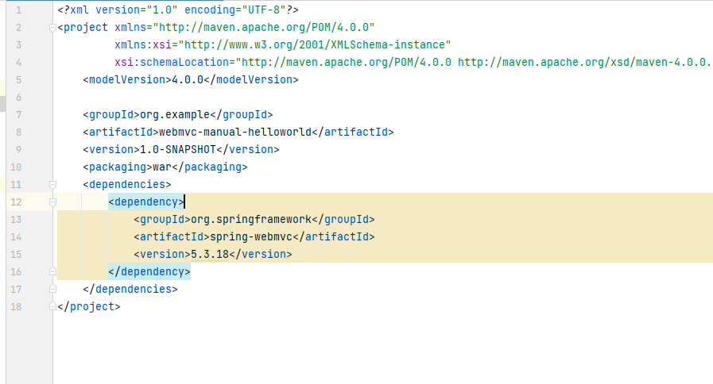
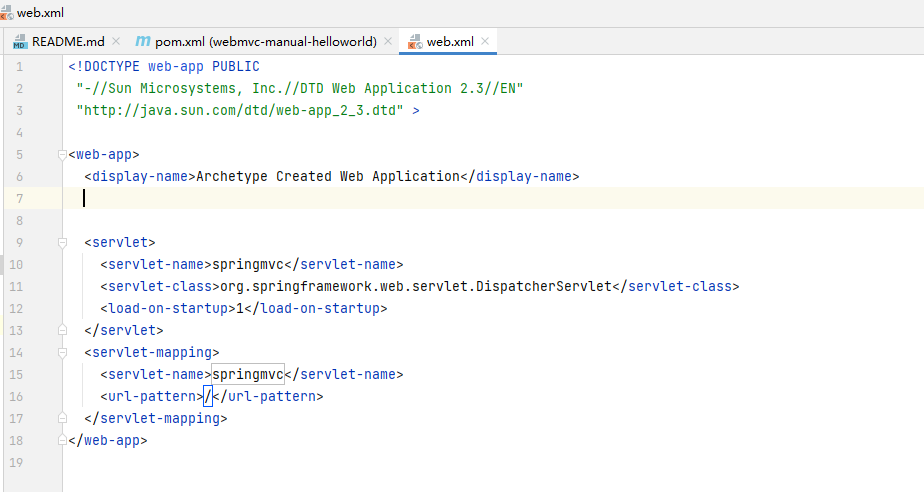
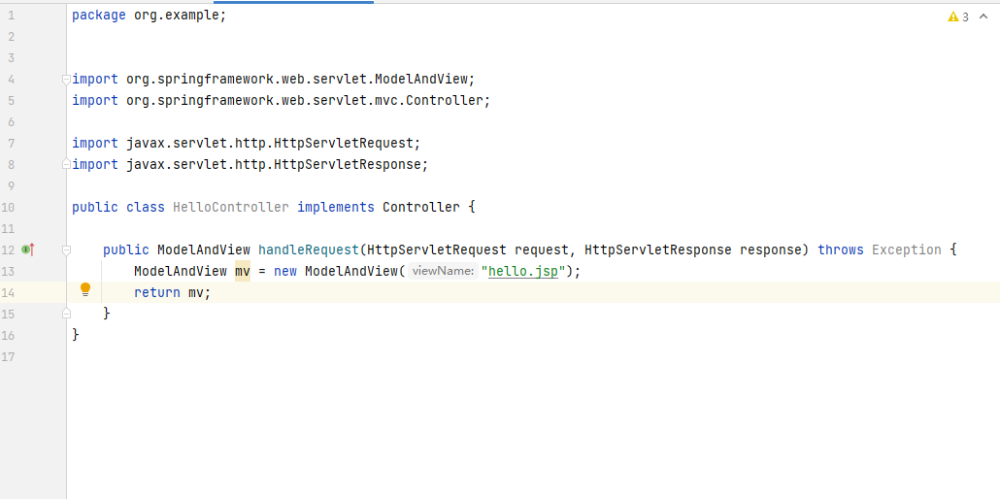
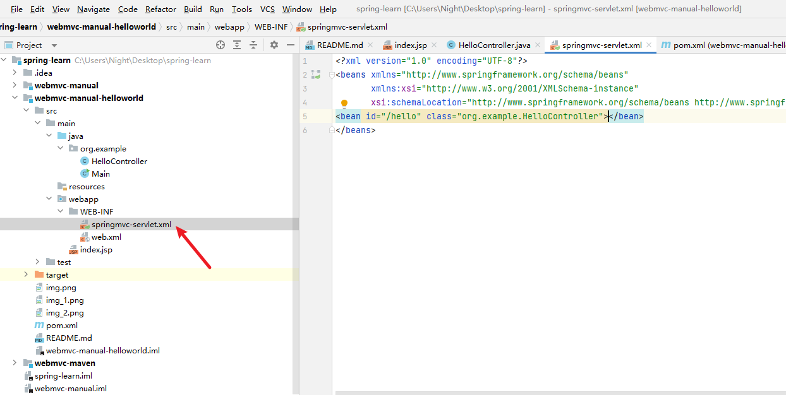
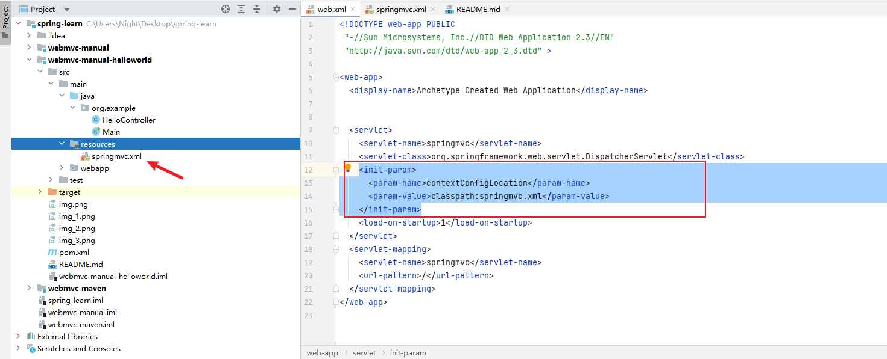

# 使用手工方式创建webmvc项目并手动加入springframework依赖

项目创建如manual


- springframework依赖导入



```xml
    <dependencies>
        <dependency>
            <groupId>org.springframework</groupId>
            <artifactId>spring-webmvc</artifactId>
            <version>5.3.18</version>
        </dependency>
    </dependencies>
```

- 配置DispatcherServlet

springmvc 的核心Servlet



```xml
<servlet>
    <servlet-name>springmvc</servlet-name>
    <servlet-class>org.springframework.web.servlet.DispatcherServlet</servlet-class>
    <load-on-startup>1</load-on-startup>
  </servlet>
  <servlet-mapping>
    <servlet-name>springmvc</servlet-name>
    <url-pattern>/</url-pattern>
  </servlet-mapping>
```

- 创建Controller


- 添加servlet依赖

```xml
<dependency>
    <groupId>javax.servlet</groupId>
    <artifactId>servlet-api</artifactId>
    <version>3.0-alpha-1</version>
    <scope>provided</scope>
</dependency>
```


- 配置springmvc-servlet.xml

文件名和org.springframework.web.servlet.DispatcherServlet对应的servlet名字一致

```xml
<?xml version="1.0" encoding="UTF-8"?>
<beans xmlns="http://www.springframework.org/schema/beans"
       xmlns:xsi="http://www.w3.org/2001/XMLSchema-instance"
       xsi:schemaLocation="http://www.springframework.org/schema/beans http://www.springframework.org/schema/beans/spring-beans.xsd">
<bean id="/hello" class="org.example.HelloController"></bean>
</beans>
```

org.springframework.web.servlet.FrameworkServlet.getNamespace()方法中会读取servlet-name-servlet.xml文件
debug路径

- 配置文件路径修改
```xml
<init-param>
    <param-name>contextConfigLocation</param-name>
    <param-value>classpath:springmvc.xml</param-value>
</init-param> 
```
运行会在classpath下寻找springmvc.xml文件

