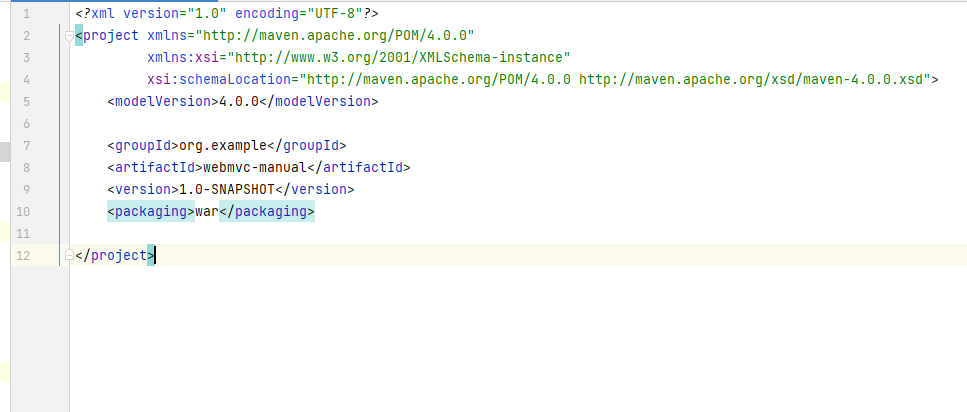

# 使用maven方式创建webmvc项目


- 创建webapp目录，创建web.xml文件，创建index.jsp文件

![img_1.png](img_1.png


web.xml

```xml
<!DOCTYPE web-app PUBLIC
 "-//Sun Microsystems, Inc.//DTD Web Application 2.3//EN"
 "http://java.sun.com/dtd/web-app_2_3.dtd" >

<web-app>
  <display-name>Archetype Created Web Application</display-name>
</web-app>

```

- pom文件添加war

```xml
<packaging>war</packaging>
```
